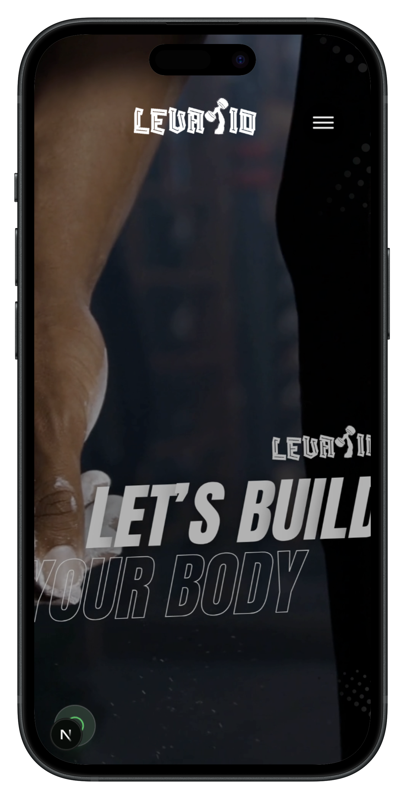
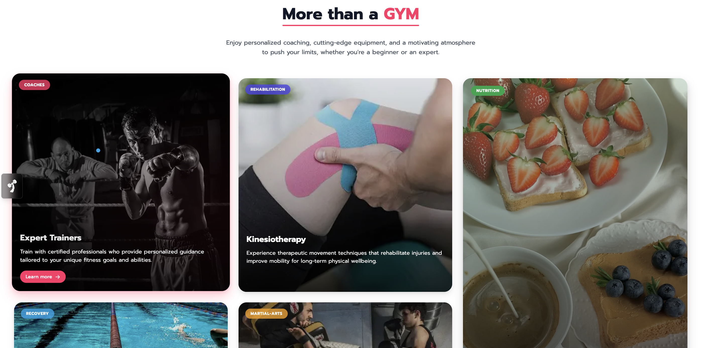
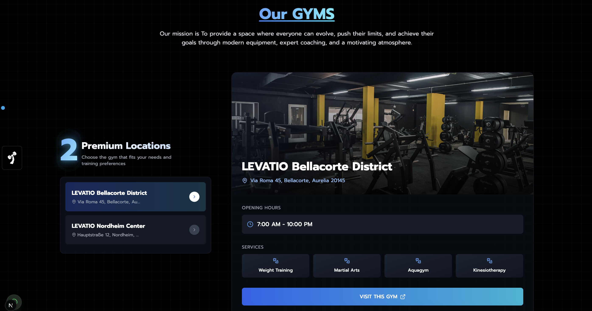
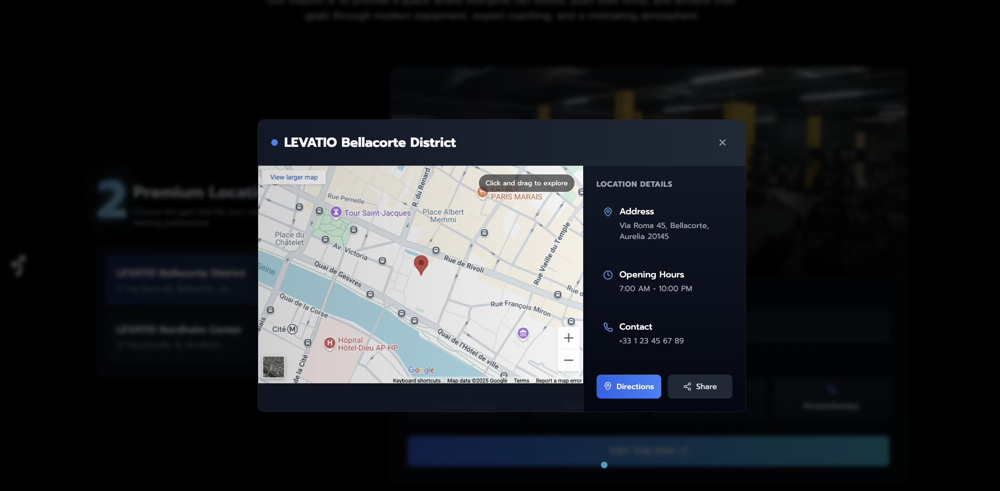
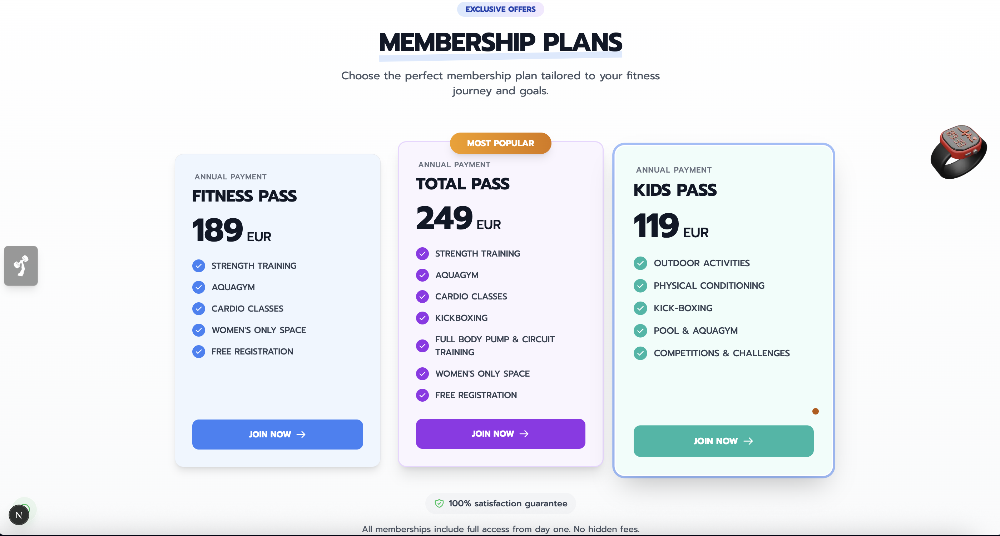

```mermaid
flowchart TB
    A[Next.js App Router] --> B[Layout System]
    A --> C[Page Components]
    A --> D[API Integrations]
    
    B --> E[Navigation Bar]
    B --> F[Footer]
    B --> G[WhatsApp Button]
    B --> H[Custom Cursor]
    
    C --> I[Hero Section]
    C --> J[Features Grid]
    C --> K[Gyms Selector]
    C --> L[Pricing Cards]
    C --> M[Contact Forms]
    C --> N[Testimonials]
    
    D --> O[Google Maps API]
    D --> P[WhatsApp Integration]
    D --> Q[Web Share API]
    D --> R[Form Handling]
    
    S[State Management] --> T[Schedule Modal]
    S --> U[Form Validation]
    S --> V[UI Interactions]
    
    W[Animation Engine] --> X[Framer Motion]
    W --> Y[CSS Transitions]
    W --> Z[Intersection Observer]
    
    AA[Media Assets] --> BB[Optimized Images]
    AA --> CC[Responsive Videos]
    AA --> DD[Custom Fonts]
    
    style A fill:#3B82F6
    style B fill:#8B5CF6
    style C fill:#06B6D4
    style D fill:#10B981
```

<div align="center">
  
  
  ### Premium Fitness Experience Platform
  
  <p align="center">
    <em>A modern, responsive web application for fitness centers with advanced features and stunning animations</em>
  </p>
</div>

---

## 📱 Live Demo

<div align="center">
  
  ### Desktop Experience

  https://github.com/user-attachments/assets/834650d6-e744-42b6-aa33-5a74a70bfb64
  
  *Complete desktop experience showcase - Full feature demonstration*
  
  ---
  
  ### Mobile Experience

**Mobile-First Approach** with adaptive layouts and touch-friendly interactions  
<br/>

<table>
  <tr>
    <td align="center">
      
      <br/>
      <em>Optimized mobile interface with smooth animations</em>
    </td>
  </tr>
</table>

  <br/> 
  <br/>

## 🌟 Key Features Overview

### ℹ️ **About & Company Information**
**Professional Company Presentation** with modern design and compelling content

<div align="center">
  
  <br/>
  <em>Comprehensive about section showcasing company values and mission</em>
</div>

   <br/>
   
### 🏋️ **Multi-Location Support**
  <br/>

**Premium Gym Locations** with interactive maps and real-time services

<div align="center">
  
  <br/>
  <em>Interactive gym location selector with detailed facility information</em>
</div>

 <br/>

### 🗺️ **Interactive Location Features**
**Advanced Mapping Integration** with Google Maps and location services

<div align="center">
  
  <br/>
  <em>Interactive location features with Google Maps integration and contact details</em>
</div>

  <br/>

  ### 💳 **Smart Membership System**
**Tier Membership Plans** with interactive pricing and streamlined registration

<div align="center">
  
  <br/>
  <em>Dynamic pricing cards with detailed feature comparisons</em>
</div>

<br/>

## 🛠️ Technology Stack

```
Frontend Framework   → Next.js 15 (React 19)
Styling              → Tailwind CSS 3.4
UI Components        → NextUI 2.6
Animations           → Framer Motion 12.7
Icons                → Lucide React & React Icons
Language             → TypeScript 5
Package Manager      → PNPM
Maps Integration     → Google Maps API
Video Processing     → Optimized MP4 delivery
Image Optimization   → Next.js Image Component
```

## 🏗️ System Architecture



## 🎯 Core Features Deep Dive

### 🏠 **Hero Section**
- **Dynamic Video Backgrounds**: Responsive video switching (desktop/mobile)
- **Smooth Transitions**: Seamless overlays and animations
- **Mobile Optimization**: Separate video files for optimal performance

### 🗺️ **Interactive Gym Locations**
- **Google Maps Integration**: Embedded maps with custom markers
- **Modal-Based Navigation**: Full-screen location viewer
- **Contact Integration**: Direct phone and navigation links
- **Responsive Controls**: Touch-optimized map interactions

### 📊 **Schedule Management System**
- **Full-Screen Viewer**: Immersive schedule browsing experience
- **Zoom & Pan**: Interactive image manipulation
- **Download Functionality**: Save schedules for offline use
- **Multiple Categories**: Men's, Women's, and Course schedules

### 📝 **Advanced Contact Forms**
- **Multi-Step Process**: Guided user experience
- **Real-Time Validation**: Instant feedback system
- **Interactive Date Picker**: Custom calendar implementation
- **Membership Selection**: Dynamic pass type selection

### 💳 **Membership Management**
- **Three Membership Tiers**: Fitness Pass, Total Pass, Kids Pass
- **Feature Comparison**: Interactive benefits display
- **Pricing Transparency**: Clear annual pricing structure
- **Instant Registration**: Streamlined signup process

## 🎨 Design System

### **Visual Design**
- **Glassmorphism Effects**: Modern backdrop blur styling throughout
- **Custom Animations**: Framer Motion powered micro-interactions
- **Responsive Typography**: Adaptive text scaling across devices
- **Color-Adaptive Cursor**: Smart cursor that adapts to backgrounds

### **Animation Framework**
- **Page Transitions**: Smooth navigation between sections
- **Scroll Animations**: Intersection Observer triggered effects
- **Hover States**: Enhanced interactive feedback
- **Loading States**: Beautiful loading animations

### **Responsive Strategy**
```css
Mobile:    < 768px   (sm)  - Touch-optimized interface
Tablet:    768px+    (md)  - Hybrid interaction model
Desktop:   1024px+   (lg)  - Full feature experience
Large:     1280px+   (xl)  - Enhanced visual elements
```

## 📂 Project Structure

```
levatio/
├── public/
│   ├── Images/
│   │   ├── demos/           # Demo screenshots and videos
│   │   ├── testimonials/    # User testimonial images
│   │   └── ...             # Static images and assets
│   ├── videos/             # Video content (hero, features)
│   └── favicon.ico         # Site favicon
├── src/
│   ├── app/
│   │   ├── globals.css     # Global styles and animations
│   │   ├── layout.tsx      # Root layout with providers
│   │   └── page.tsx        # Home page composition
│   └── components/
│       ├── sections/       # Page sections (Hero, Features, etc.)
│       ├── ui/            # Reusable UI components
│       ├── Navbar.tsx     # Navigation with schedule modal
│       ├── Footer.tsx     # Footer with contact info
│       ├── WhatsAppButton.tsx  # Floating WhatsApp integration
│       └── ClientCursor.tsx    # Custom cursor implementation
├── tailwind.config.js      # Tailwind configuration
├── next.config.ts         # Next.js configuration
├── tsconfig.json          # TypeScript configuration
└── package.json           # Dependencies and scripts
```

## 🚀 Performance Features

### **Optimization Techniques**
- **Next.js Image Optimization**: Automatic WebP conversion and lazy loading
- **Video Compression**: Optimized video delivery for different devices
- **Code Splitting**: Component-level code splitting for faster loads
- **Progressive Loading**: Intersection Observer for performance

### **SEO & Accessibility**
- **Semantic HTML**: Proper heading structure and ARIA labels
- **Meta Tags**: Comprehensive Open Graph and Twitter Card support
- **Alt Text**: Descriptive alt text for all images
- **Keyboard Navigation**: Full keyboard accessibility support

## 🎯 User Experience Features

### **Interactive Elements**
- **Custom Cursor**: Intelligent cursor that adapts to content
- **Smooth Scrolling**: CSS scroll-behavior with JavaScript enhancements
- **Touch Gestures**: Mobile-optimized touch interactions
- **Visual Feedback**: Consistent hover and focus states

### **Accessibility Features**
- **Screen Reader Support**: ARIA labels and semantic markup
- **High Contrast**: Adequate color contrast ratios
- **Reduced Motion**: Respects user's motion preferences
- **Keyboard Navigation**: Tab-accessible interface

## 📊 Technical Specifications

### **Development Environment**
```bash
Node.js:     18+ (LTS recommended)
Package Manager: PNPM (preferred) or NPM
TypeScript:  5.x (strict mode enabled)
ESLint:      9.x (Next.js configuration)
```

### **Browser Support**
- **Modern Browsers**: Chrome 88+, Firefox 78+, Safari 14+, Edge 88+
- **Mobile Browsers**: iOS Safari 14+, Android Chrome 88+
- **JavaScript**: ES2020+ features utilized
- **CSS**: Modern CSS Grid, Flexbox, and Custom Properties

## 🔧 Configuration Files

The project includes comprehensive configuration for development and production:

- **TypeScript**: Strict type checking with modern compiler options
- **Tailwind CSS**: Custom utility classes and component patterns
- **Next.js**: Optimized for performance and SEO
- **ESLint**: Code quality and consistency enforcement

## 📱 Mobile Experience

The mobile experience is specifically optimized with:
- **Touch-First Design**: All interactions optimized for touch
- **Responsive Videos**: Device-specific video assets
- **Mobile Navigation**: Collapsible menu with smooth animations
- **Performance**: Optimized bundle size for mobile networks

## 🎨 Brand Assets

All brand assets including logos, color schemes, and typography are professionally designed and integrated throughout the application for consistent brand experience.

## 📄 License

**Copyright © 2025 - All Rights Reserved**

This software and associated documentation files are proprietary and confidential. Unauthorized copying, distribution, or use is strictly prohibited without explicit written permission.

## 🚨 COPYRIGHT NOTICE

**⚠️ This project is STRICTLY COPYRIGHTED and PROPRIETARY**

All code, designs, assets, and documentation in this repository are the exclusive property of the copyright holders. **NO USAGE IS PERMITTED** without explicit written authorization.

- ❌ **NO** copying, forking, or downloading
- ❌ **NO** modifications or derivative works  
- ❌ **NO** commercial or personal use
- ❌ **NO** reverse engineering or analysis
- ❌ **NO** contributions accepted

For licensing inquiries or permission requests, contact the development team through official channels.

## 📞 Contact

For licensing inquiries or permission requests, please contact the development team through official channels.

---

<div align="center">
<p><strong>⟡ yasxEd ⟡</strong></p>
</div>

